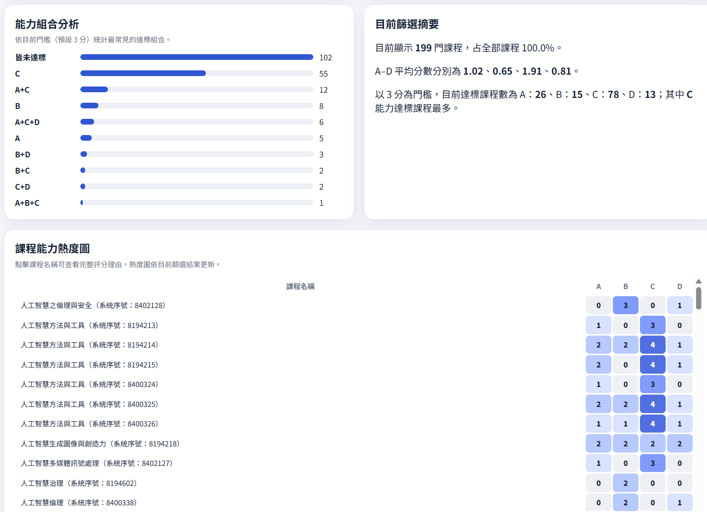
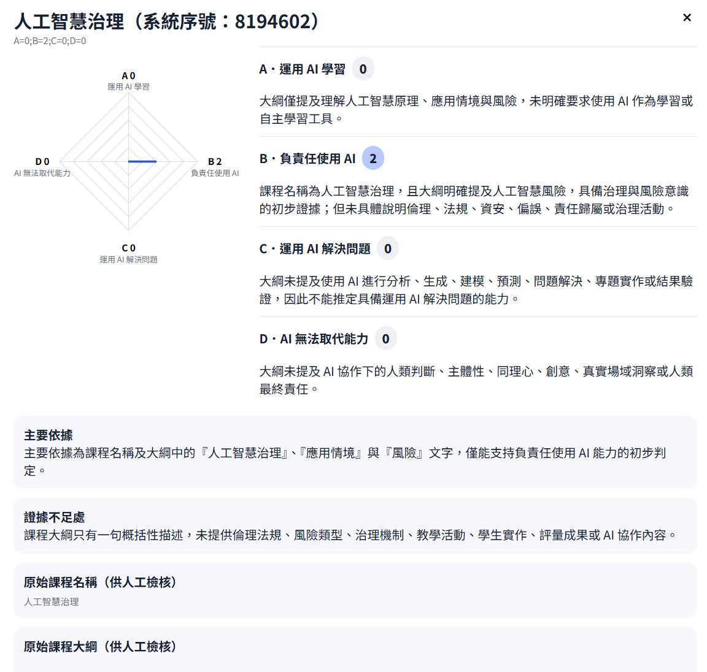
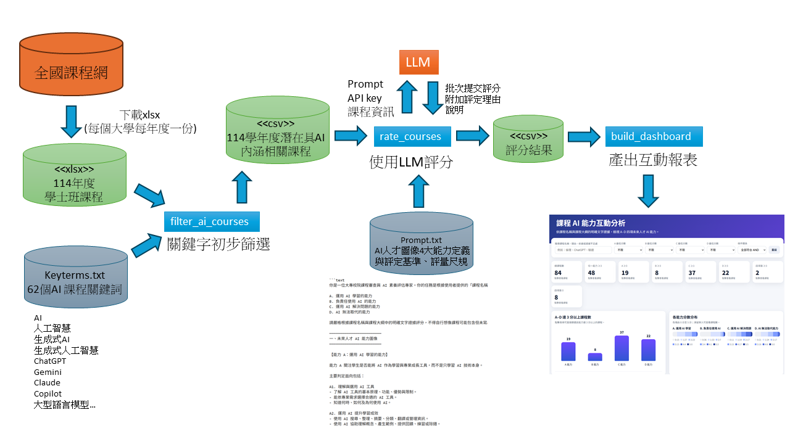

# 未來人才AI能力圖像課程初評工具

本專案基於全國課程網所匯出的課程資料，在篩選出初步課程後，針對該課程教育部AI人才圖像核心能力分別加以評分，並輸出為html檔。提供各校自行初步進行盤點，細部流程如下:

1. 使用者由全國課程網，取出要評估課程，並匯出為xlsx  (預設為input.xlsx)
2. 關鍵字篩選: 基於 [keyterms.txt](keyterms.txt) 初步篩選 AI 相關課程，並輸出為csv (預設為ai-courses.csv)
3. 使用LLM 依規則([prompt.txt](prompt.txt))產出 A–D 能力評分，輸出為csv (預設為rating.csv)
4. 產生可互動檢視的分析儀表板(單一html，輸出檔名可由 `--output` 指定)






## 注意事項

1. AI判讀的正確性是建立在輸入課程資料的正確性，各校需要自行確認輸入之課程資料的正確性。
2. AI判讀結果可能產生錯誤偏差，引用其結果時必須謹慎，結果僅提供各校快速初步了解現況; 新開課程宜由授課教師自行評估能力符合程度。

## 已知問題與限制
1. 本工具只依賴「課程名稱」與「課程簡述」評分，評分準確度受原始資料與模型品質影響，不同模型之間評分存在差異。
2. 由於生成式AI的特性，相同內容多次評分未必一致，經調整過後，應大致可維持一致，但隨模型能力不同仍可能有些許相同內容評分二次不一致的狀況。
3. 全國課程網匯出以xlsx格式為主，因為其csv格式遇欄位內容有逗號會與csv格式衝突造成資料抓取錯誤
4. 建議4項能力評分皆為0分的課程應人工檢核原因。
5. 目前只支援OpenAI相容介面。

## 系統架構

主要Python腳本依功能分為三個工具：

- `filter_ai_courses`: 關鍵字初步篩選
- `rate_courses`: AI人才圖像能力課程評分
- `build_dashboard`: 將結果轉成互動式html



## 執行需求

- Python 3.9+
- exe檔只適用Windows 系統; 其它平台須先安裝python，透過python runtime執行。
- 課程評分模組`rate_courses` 需要可連線的 LLM API，將API key設定為環境變數，建議勿將API key寫死在程式碼中

## 版本發布

- [release/release.md](release/release.md)：發佈說明與下載連結。

## 使用說明 (尚未完善，持續改進中)

- 安裝與使用說明文件 [doc/document.md](doc/document.md)
- 操作範例(以政大114學年度課程分析為例) [release/example-nccu.md](release/example-nccu.md)

## 開發者注意事項

本區資訊供自行修改程式碼的開發人員參考。

### 打包成 exe

先安裝打包依賴的函式庫：

```powershell
pip install -e .[build]
```

執行打包腳本，會把 3 個 exe 輸出到 `release/`，並另外產生 `release/release-win.zip`：

```powershell
python tools/build.py
```


### 專案結構

```text
.
├─ pyproject.toml             # 專案依賴設定（uv）
├─ uv.lock                    # uv 鎖定檔
├─ filter_ai_courses.py       # 課程篩選
├─ rate_courses.py            # LLM 評分
├─ build_dashboard.py         # 產生儀表板
├─ ai-courses.csv             # 篩選後課程（由 filter_ai_courses.py 產生）
├─ rating.csv                 # LLM 評分結果
├─ failed.csv                 # 評分失敗批次的課程（由 rate_courses.py 產生）
├─ keyterms.txt            # AI 關鍵詞清單（一行一個）
├─ prompt.txt              # 評分規則（LLM system prompt）
├─ dashboard_template.html # 儀表板 HTML 樣板
├─ data/                      # 範例與歷史資料
├─ release/                   # exe 與 release-win.zip 發佈目錄
└─ tools/                     # 輔助工具
  ├─ build.py
  └─ testLLM.py
```


### 輸入欄位（篩選與評分）

篩選與評分至少需要以下欄位：

- 課程名稱
- 課程大綱

`rate_courses.py` 若輸入檔含 `系統序號` 欄位，會一併寫入輸出 `rating.csv`；若缺少此欄位，程式會警告並留空。

`rate_courses.py` 切分批次時，若相鄰課程的「課程名稱」相同，會保留在同一批，即使該批次因此超過 `--batch-size`；發生此情況時，程式也會在送給模型的 prompt 中明確說明。

### `rating.csv` 主要欄位

- 系統序號
- 課程名稱
- 課程大綱（由程式回填，供人工檢核）
- A分數, A判定理由
- B分數, B判定理由
- C分數, C判定理由
- D分數, D判定理由
- 整體判定
- 主要依據
- 證據不足處

儀表板顯示時，課名後會加註系統序號（例如：`課程名稱（系統序號：8400328）`），方便人工比對原始資料。

`rate_courses.py` 會另外輸出 `failed.csv`；若有失敗批次，檔內會列出尚未成功評分的課程，若沒有失敗則檔案只包含表頭，方便單獨重跑。

<!-- ## 常見問題

### 1. 為什麼沒有產生任何篩選結果？

- 檢查 `keyterms.txt` 是否為一行一詞
- 檢查 `input.csv` 欄位名是否包含「課程名稱」「課程大綱」
- 若欄位名稱不同，請先調整 CSV 欄位或修改腳本對應欄位

### 2. LLM 回傳格式不穩，導致某些課程沒被解析？

- 降低 `--batch-size`
- 增加 `--max-retries`
- 使用 `--raw-log-dir logs` 檢查原始回應

### 3. 儀表板打不開或資料是空的？

- 確認 `rating.csv` 非空且欄位完整
- 確認 `dashboard_template2.html` 存在且未破壞占位符號 -->

## 備註


