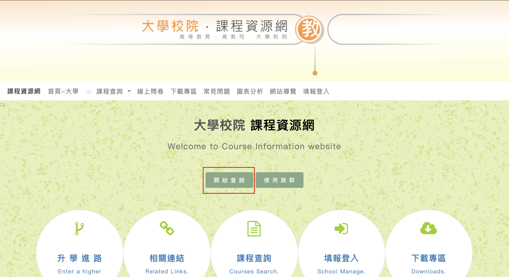
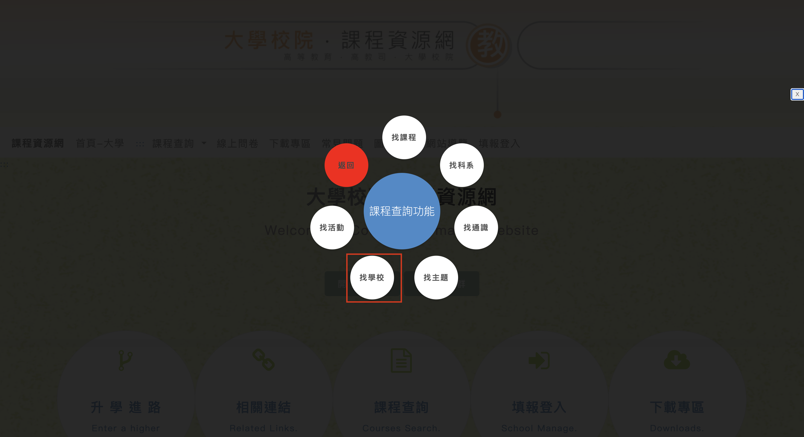
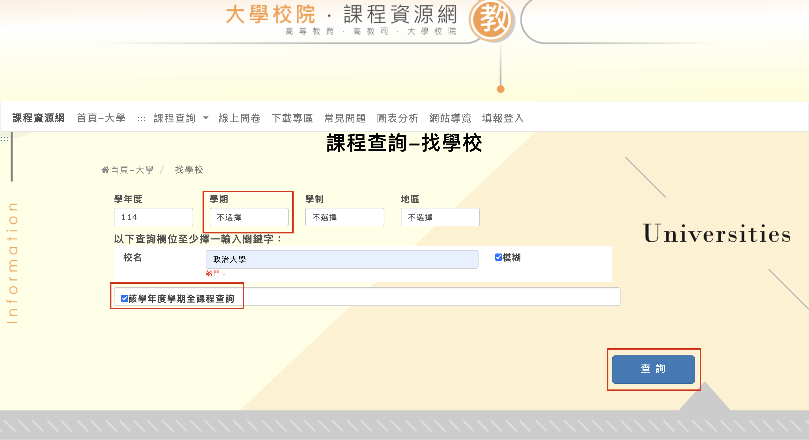
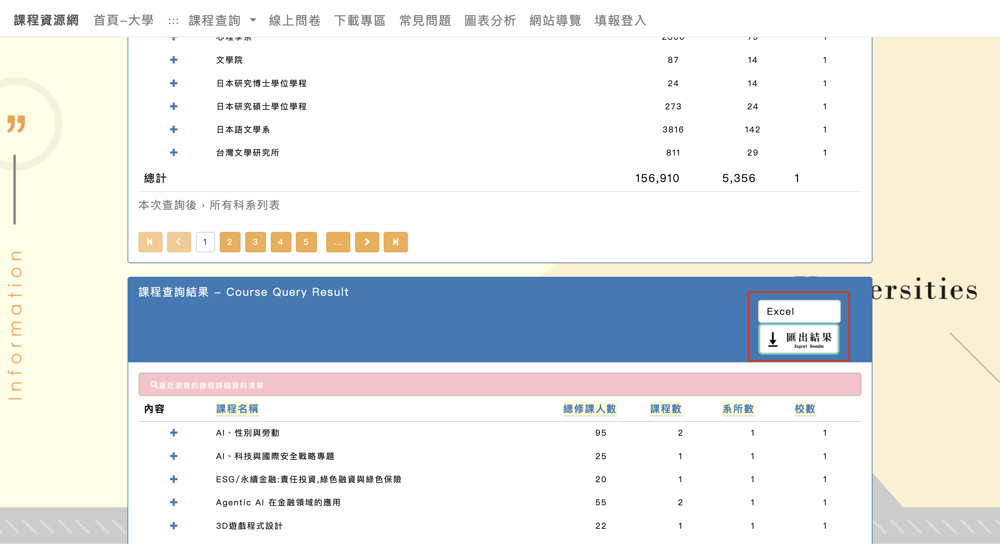
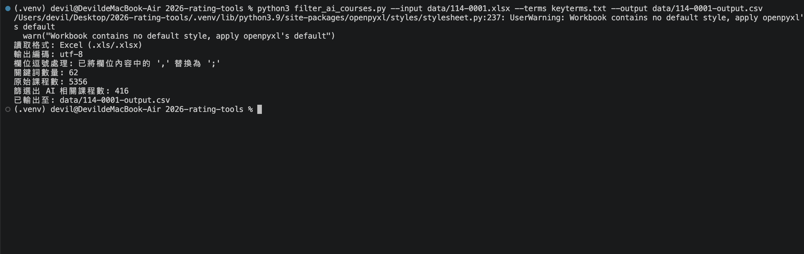
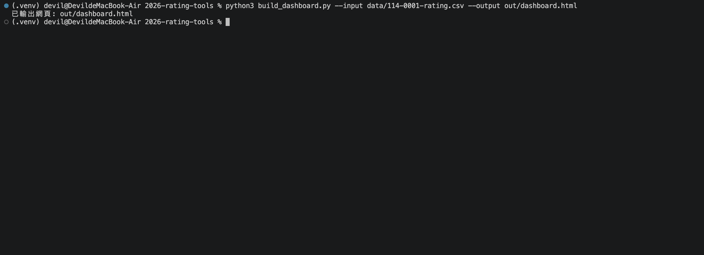

# 以政大114學年度課程為例

## 下傳課程檔案(xlsx)

## 環境設定 (Mac)

## 1. 下載課程檔案

到全國課程網下載政大 114 學年度課程資料。


1. 到全國課程網下載政大114學年

    [點我前往 全國課程網](https://course-tvc.yuntech.edu.tw/webU/index.aspx)




2. 點選開始查詢    



3. 點選學校



   注意紅匡要記得更改及勾選！！在按查詢
   
4. 直接下載即可




下載後，將課程檔案放到專案的 `data` 資料夾中，例如：

```text
data/114-0001.xlsx
```

---

## 2. 篩選 AI 相關課程

在下方終端機 Terminal 中輸入：

```bash
python3 filter_ai_courses.py --input data/114-0001.xlsx --terms keyterms.txt --output data/114-0001-output.csv
```


執行後會在 `data` 資料夾中產生：

```text
114-0001-output.csv
```

---

## 3. 使用 OpenAI 評分課程

接著輸入：

```Terminal
export OPENAI_API_KEY="your_key"
    python3 rate_courses.py --model gpt-5.6-luna \\
        --base-url https://api.openai.com/v1 \\
        --input data/114-0001-output.csv --prompt prompt.txt --output data/114-0001-rating.csv
```

請將 `your_key` 換成自己的 OpenAI API Key。

執行後會在 `data` 資料夾中產生：

```text
114-0001-rating.csv
```


若想測試可以打下方指令
```Terminal
python3 rate_courses.py --input data/114-0001-output.csv --prompt prompt.txt --dry-run
```


---

## 4. 產生 Dashboard 網頁

在 Terminal 中輸入：

```powershell
python3 build_dashboard.py --input data/114-0001-rating.csv --output out/dashboard.html
```

執行後會在 `out` 資料夾中產生：

```text
dashboard.html
```

點開 `out/dashboard.html` 即可使用互動式網頁。